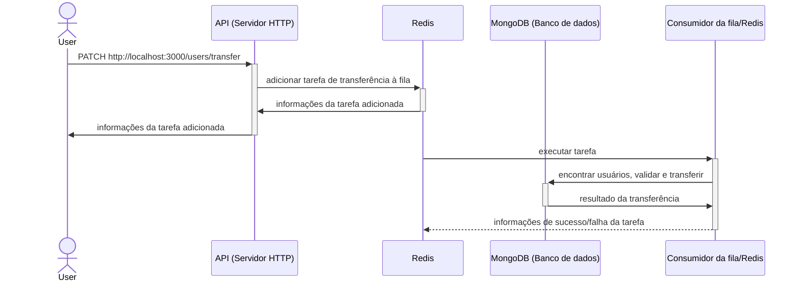
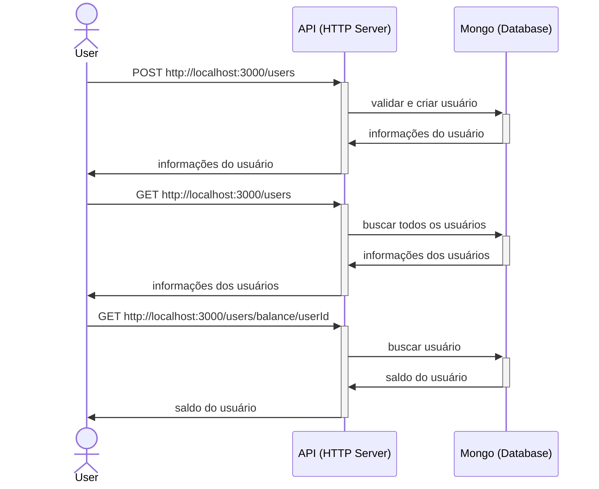

# Teste LeanSaúde - StartUp Fintech

- [Diagrama da aplicação](#Diagrama-da-aplicação)
- [Inicializar aplicação](#Inicializar-aplicação)
- [Testar aplicação](#Testar-aplicação)

## Diagrama do sistema

### Transferir



### Operações de leitura/escrita de usuários



## Inicializar sistema

### Pré-requisitos

Para inicializar a aplicação, é necessário ter instalado:

- Docker
- Docker Compose

### Inicialização

```bash
./init.sh
```

É importante aguardar até que o container `teste-leansaude-api` esteja saudável. Para garantir isso, é possível verificar se o container possui status `(healthy)` com o comando abaixo, que deve retornar informações do container:

```bash
docker container ls --filter "name=teste-leansaude-api" --filter "health=healthy"
```

## Testar aplicações

### Testes unitários

Executar, dentro das pastas /api e /redis-consumer, o comando `yarn test`. Pode ser executado sem inicializar as aplicações.

### Chamadas ao serviço HTTP

Há um arquivo chamado `api.http` que funciona junto com o plugin do Visual Studio Code `REST Client`. Este arquivo contém uma sequência de chamadas HTTP que testa as funcionalidades da aplicação. É preciso substituir <userId> pelo valor correspondente após a criação dos usuários. Precisa ser executado após a inicialização do sistema.
